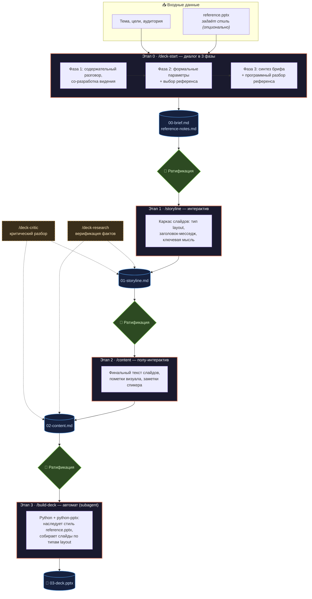

# 🎤 Claude Deck Pipeline

**Агентный пайплайн для генерации презентаций: от разговора о теме до готового PPTX — с человеком в петле на каждом содержательном этапе.**

[](https://claude.com/claude-code)
[](https://python-pptx.readthedocs.io/)
[](LICENSE)

## Идея

Главный источник ценности презентации — **структура мысли**, а не оформление слайдов. Поэтому пайплайн устроен так, что человек участвует именно там, где его суждение незаменимо (выбор сторилайна, формулировки месседжей), и не участвует на механических этапах (сборка PPTX).

Каждый этап — отдельный агент со своим плейбуком (слэш-команда Claude Code). Этапы общаются между собой **только через файлы-артефакты**: пайплайн можно прервать в любой момент и вернуться через неделю без потери контекста.

## Концептуальная схема



**Зелёные ромбы** — точки, где пользователь утверждает артефакт перед переходом дальше. **Пунктирные блоки** — опциональные агенты (`/deck-critic`, `/deck-research`, а также `/deck-resume` для возврата к незаконченной презентации): они спроектированы в [архитектуре](docs/ARCHITECTURE.md#опциональные-агенты), команды для них — в roadmap.

## Этапы пайплайна

| Этап | Команда | Тип | Вход | Выход |
|------|---------|-----|------|-------|
| 0 | `/deck-start` | диалог в 3 фазы | тема, цели, референс | `00-brief.md`, `reference-notes.md` |
| 1 | `/storyline` | интерактив | бриф + разбор референса | `01-storyline.md` |
| 2 | `/content` | полу-интерактив | сторилайн + бриф | `02-content.md` |
| 3 | `/build-deck` | subagent, автомат | контент + `reference.pptx` | `03-deck.pptx` |

### Этап 0 — `/deck-start`

Не «заполнение анкеты», а первый содержательный разговор о презентации. Агент сначала просит описать контекст в свободной форме, добирает 2–3 уточнения по скрытому чек-листу (тема / слушатель / решение / ключевая идея), а затем **сам предлагает целевое видение**: главный месседж, 3–7 тезисов, логику повествования. Агент обязан занимать позицию — пользователь хочет со-думателя, а не каталог опций.

Здесь же выбирается **референс стиля**: свой PPTX, шаблон из библиотеки или «без референса». Референс программно разбирается через `python-pptx`, и агент пишет `reference-notes.md` — но извлекает **только форму** (типы композиций, плотность текста, тон), никогда не содержание.

### Этап 1 — `/storyline`

Каркас презентации: для каждого слайда — тип layout из палитры референса, заголовок-месседж (не тема!) и одна ключевая мысль. Это slash-команда, а не subagent, потому что здесь важен живой диалог: «убери слайд 4», «переставь 3 и 5», «тут не тот месседж». Лимит слайдов из брифа — святое: если тезисов больше, агент честно режет и объясняет что и почему.

### Этап 2 — `/content`

Финальный текст каждого слайда: заголовок, тело по форме layout'а, конкретные пометки визуала («график X с такими осями», не «какая-то картинка»), заметки спикера для устных выступлений. Плотность текста калибруется по референсу. Цифры — только из брифа: чего нет, помечается «уточнить» или уходит в research.

### Этап 3 — `/build-deck`

Чисто механика, поэтому subagent с изолированным контекстом: пишет Python-скрипт на `python-pptx`, наследует размеры и мастер-слайды из `reference.pptx`, собирает слайды через функции-раскладки `add_<type>_slide()` и сохраняет `03-deck.pptx`. Шумные логи сборки не засоряют основной чат — в него возвращается только краткий отчёт.

## Ключевые проектные решения

- **Артефакты — файлы, а не состояние чата.** Чат может потеряться, контекст — компактироваться; `01-storyline.md` останется. Любой этап можно перезапустить отдельно.
- **3 этапа, а не 1 или 5.** Это минимум, разделяющий три действительно разные задачи: *что говорим* (storyline), *как говорим* (content), *как выглядит* (build).
- **Стиль — per-deck через пример, а не через style-guide.** Описать стиль словами работает плохо; показать `reference.pptx` — точно. Общими остаются только технические правила работы с PPTX.
- **Режим пайплайна — per-deck.** Файл `.mode` (`autonomous` / `manual`) определяет, переходят ли команды к следующему этапу сами или спрашивают разрешения.
- **Заголовок = месседж, не тема.** «Запускаем AI Lab через месяц» — да. «О формате AI Lab» — нет.

Полные обоснования — в [docs/ARCHITECTURE.md](docs/ARCHITECTURE.md).

## Структура репозитория

```
.
├── CLAUDE.md                 # инструкции проекта для Claude Code
├── commands/                 # слэш-команды → скопировать в ~/.claude/commands/
│   ├── deck-start.md         #   этап 0: бриф
│   ├── storyline.md          #   этап 1: каркас
│   ├── content.md            #   этап 2: текст
│   └── build-deck.md         #   этап 3: сборка PPTX
├── decks/
│   └── _template/            # эталон папки новой презентации
├── templates/                # библиотека многоразовых PPTX-эталонов (своя у каждого)
├── style/                    # общие технические правила сборки
└── docs/
    └── ARCHITECTURE.md       # полная архитектура и обоснования решений
```

Каждая презентация живёт в своей папке `decks/YYYY-MM-DD-<имя>/` со всеми артефактами от брифа до финального PPTX.

## Установка

```bash
git clone https://github.com/abuklikov/claude-deck-pipeline.git ~/presentations
cp ~/presentations/commands/*.md ~/.claude/commands/

# окружение для сборки PPTX
python3 -m venv ~/presentations/.venv
~/presentations/.venv/bin/pip install python-pptx
```

Дальше в Claude Code из любой директории:

```
/deck-start my-presentation
```

…и пайплайн поведёт сам: разговор о теме → бриф → сторилайн → контент → PPTX.

## Перенос в Claude.app

Та же система работает и в облачном Claude как Project: `CLAUDE.md` → Custom Instructions, слэш-команды → Skills, `python-pptx` → Code Execution. Таблица соответствий — в [docs/ARCHITECTURE.md](docs/ARCHITECTURE.md#версия-в-claudeapp-project-облако).

## Лицензия

[MIT](LICENSE)
